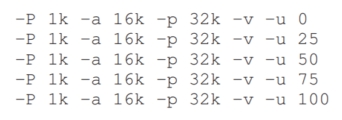
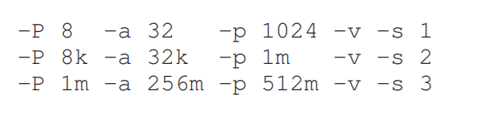

### 虚存&地址空间

1.linux系统有许多管理地址空间的工具。请自行学习linux系统的free指令，并使用free指令展示系统的空闲内存。

2.linux系统还有pmap工具用于查看进程的内存信息。请学习pmap指令的用法，并随意指定几个不同进程使用pmap来查看它们对应的地址空间。请比较它们的输出和我们课程上介绍的简单内存空间模型的区别。

3.请使用c语言写一个简单的程序来探索地址空间。它的功能是静态分配指定大小的内存并依次访问它们，并需要接受一个参数作为该内存的大小。分别针对不同的分配大小，使用free指令和pmap指令来查看程序运行是否符合你预期的情况。

4.编写一个含有malloc动态分配内存的c程序，针对访问越界、未释放内存以及未分配内存就访问等情况选择一个或多个，在http://valgrind.org/downloads/current.html安装内存检查工具valgrind，并使用其查看bug的结果和你的设计是否符合。

5.下载paging-linear-translate.py文件。它针对的是最简单的线性映射情况。请进行如下操作。

- 使用下列作为参数，探究增大地址空间页表占比之后的会发生什么。

  

- 请更换程序之中的随机种子，并尝试下列非常规的参数。那一组参数对于该程序而言是不现实的？

  

- 请探究什么时候程序就失效了，比如分配的地址空间大于实际空间。并记录这些参数下程序的表现。

6.请计算如果使用单级页表对4GB物理地址空间进行线性映射，页面大小为4KB，PTE大小为4byte。请计算大概需要多少个页面以及它们所占的大小。请描述为什么在现代计算机中面对这种占用仍然需要设计新的策略来避免过大内存的占用？

7.下载paging-multilevel-translate.py文件来模拟多级页表的功能，并完成如下的问题。

- 请指出使用2级和3级页表分别需要几个寄存器来实现完整的地址查找过程？
- 设置模拟页表文件的随机种子分别为0，1，2(使用-a参数可以修改)，同时使用-c flag来检查输出。分别指出需要多少内存引用来完成1次查找？
- 请你指出，引入虚存机制之后cache的hit/miss情况分别有什么变化。

8.页表还需要更多的机制来实现对于页交换等场景的支持。请下载提供的mem.c文件并编译运行（该程序是一个无限循环程序）。回答下列问题。

- 使用vmstat指令可以实时监控虚存的交换情况等等。请执行./mem 1(这意味着程序占用1MB内存)，并查看1个或多个程序一起运行的时候vmstat显示参数的改变。
- 执行./mem 1024指令。查看vmstat指令的swpd和free两列随着时间的变化，并记录下杀掉该程序之后值的变化。（着重关注free列的变化）
- 下面我们主要关注swap相关的信息。首先请获得你linux系统中空闲内存的大小（可以通过查看proc/meminfo实现）。请在mem程序分别占用50%，65%，75%空闲内存时做测试，并主要关注swap in/out项。请问该项出现过0值吗？并指出程序进入第二次循环的时候，这两个参数的变化。在之后的循环之中，有多少数据被换入/换出了？
- 使用swapon -s指令可以查看系统有多少内存空间可供交换。请逐渐增大mem程序的分配空间，并查看，当需求空间到什么大小的时候，mem程序内存的分配失败了。

9.页的交换有着不同的策略。请下载文件paging-policy.py。并完成如下的问题。

- 分别使用 -s 0 -n 10, -s 1 -n 10, -s 2 -n 10产生随机的地址，并分别在FIFO，LRU, OPT这3种策略下看看这些地址访问是否命中。(-s参数影响随机种子,-n影响生成的地址数量)
- 针对cache_size = 5的情况，在FIFO, LRU, MRU之中分别设计一种会导致最大缺失率的访问序列。请说明要把cache增加到多大，才能让这些策略的命中率接近OPT?
- 请随机生成一个访存地址序列（可以使用python等。这个问题的分析可以不使用模拟程序），该序列的访问地址局限在某一个小的区间内。请比较LRU和RAND页表交换策略在这个序列上的命中率。并测试当clock bits不同时，CLOCK算法在这个地址上页面交换的效率。

